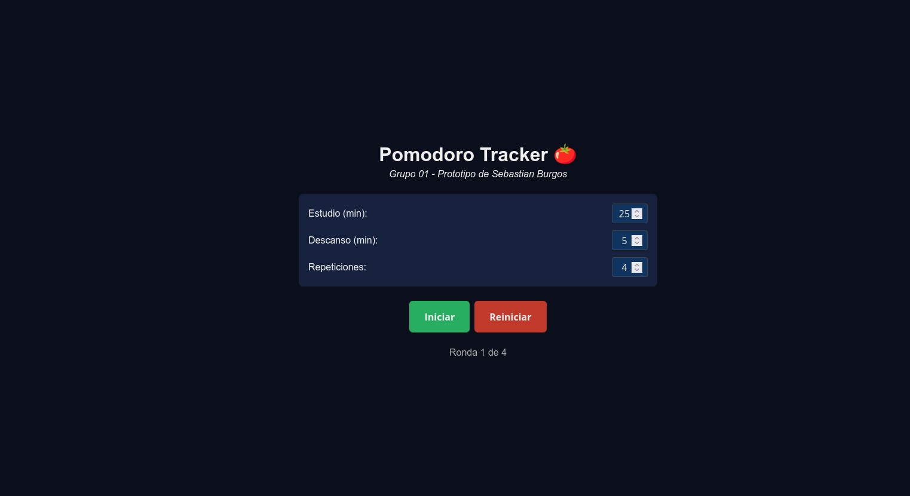
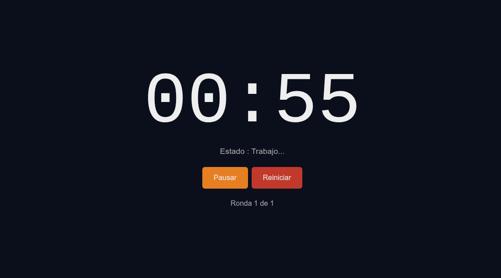
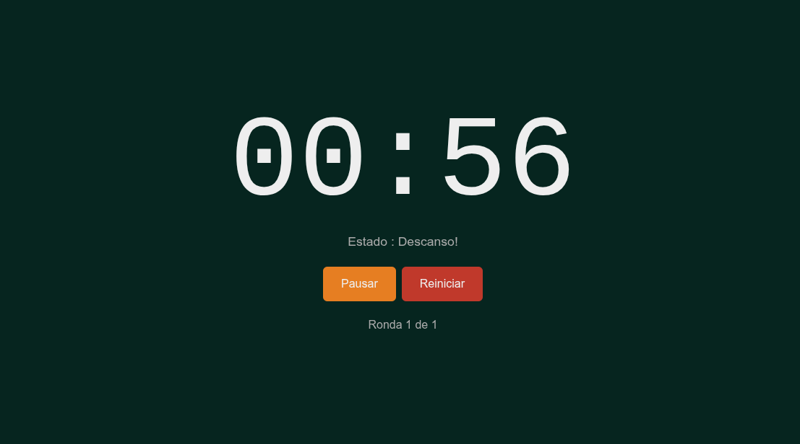
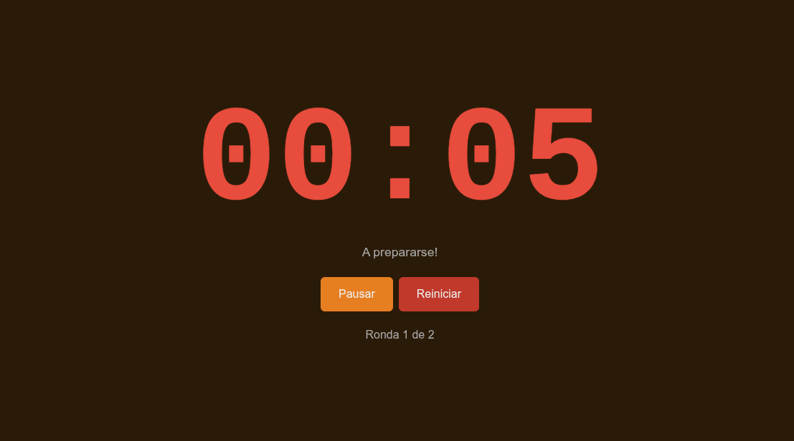

# SPRINT 0: INFO104

## Grupo 01: "Pomodoro Tracker"

### Prototipo de Sebastian Burgos Maldonado

#### **DISCLAMER**: Este repositorio contiene una version temprana y muy basica de lo que será el trabajo final, por lo que las funcionalidades deseadas no estan implementadas aún. La idea de este prototipo es para evaluar el diseño de la aplicacion, ademas de la forma que se implementaran las funcionalidades en el proyecto final

***Descripcion:***  
"Pomodoro Tracker es aplicación web echa en el framework NextJS, que permite a los usuarios llevar un registro de su estudio utilizando la técnica Pomodoro. Cuenta con un temporizador configurable, un historial de sesiones y estadísticas de productividad. La aplicación está diseñada para ayudar a los usuarios a mejorar su enfoque y eficiencia en el estudio."

**- Capturas:**
<figure style="margin: 0 0 16px 0;">
	<figcaption style="margin: 0 0 4px 0; padding: 0;">Pantalla principal del temporizador</figcaption>
	
</figure>
<figure style="margin: 0 0 16px 0;">
	<figcaption style="margin: 0 0 4px 0; padding: 0;">Temporizador en funcionamiento</figcaption>
	
</figure>
<figure style="margin: 0 0 16px 0;">
	<figcaption style="margin: 0 0 4px 0; padding: 0;">Estado de descanso</figcaption>
	
</figure>
<figure style="margin: 0 0 16px 0;">
	<figcaption style="margin: 0 0 4px 0; padding: 0;">Cuenta regresiva de descanso</figcaption>
	
</figure>


Para ver la pagina, clonar el repositorio :
```
git clone https://github.com/Louwz777/pomodoro_tracker.git
```

y ejecutar :
```
# con npm
npm install
npm run dev

# con yarn
yarn install
yarn dev
```

**TODO**:

- Mejorar interfaz
- Registro de progreso
- Agregar funcionalidad de meta diaria
- Implementar notificaciones y recordatorios
- Graficos diarios de productividad
